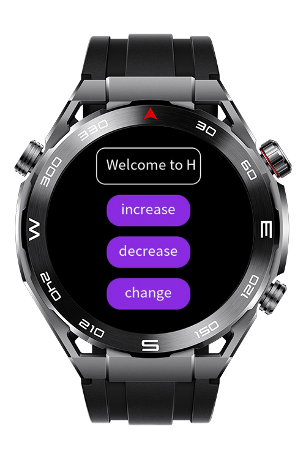

> **Note:** To access all shared projects, get information about environment setup, and view other guides, please visit [Explore-In-HMOS-Wearable Index](https://github.com/Explore-In-HMOS-Wearable/hmos-index).

# How To Use Marquee in Lite Wearable?

HarmonyOS application that showing how Marquee can be implemented on lite wearable devices.

# Preview

<p align="left">
  
</p>

# Use Cases

- The user displays a scrolling text on the screen. The marquee text initially displays as Welcome to HOS Next!
- The user presses the "Change" button. The marquee text is selected sequentially from four predefined messages. The texts are displayed cyclically, looping back to the beginning after the last text.
- The user presses the "increase" button. The marquee slide speed increases.
- The user presses the "decrease" button. The marquee slide speed decreases.
- Minimum speed limit: 1 , speed cannot fall below this.

# Tech Stack

- **Languages**: JS
- **Frameworks**: HarmonyOS SDK 5.0.0(12)
- **Tools**: DevEco Studio Vers 5.1.0.842

# Directory Structure

```
entry/src/main/js/MainAbility
│    pages/
│     └── index.css
│     └── index.hml
│     └── index.js
└──  i18n
      ├── en-US.json
      └── zh-CN.json
└──  app.js
```

# Constraints and Restrictions

## Supported Devices

- Huawei Sport (Lite) Watch GT 4/5/6
- Huawei Sport (Lite) GT5/6 Pro 
- Huawei Sport (Lite) Fit 3/4 
- Huawei Sport (Lite) D2 
- Huawei Sport (Lite) Ultimate

# LICENSE
**How To Use Marquee in Lite Wearable?** is distributed under the terms of the MIT License.
See the [LICENSE](/LICENSE) for more information.
